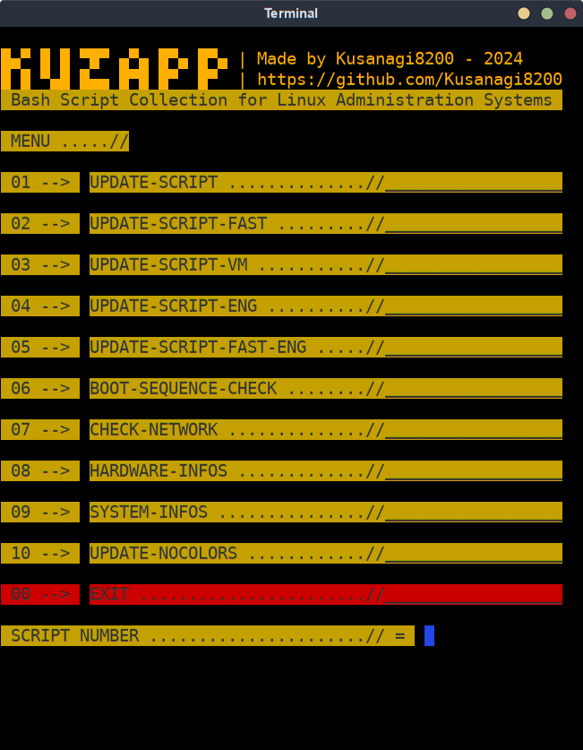

### **System Maintenance Information and Diagnostic Script** 

 

#### **Bash version**

**The bash script provides an interface to execute a variety of sub-scripts that perform system cleaning, diagnostic, and network information tasks.**

#### **Features**

The script displays a menu with several options, each corresponding to a different sub-script :

  + 01 **UPDATE-SCRIPT**: Update the system.
  + 02 **UPDATE-SCRIPT-FAST**: Quick system update.
  + 03 **UPDATE-SCRIPT-VM**: Update specifically for virtual machines.
  + 04 **UPDATE-SCRIPT-ENG**: English version of the Update script.
  + 05 **UPDATE-SCRIPT-FAST-ENG**: English version of the quick Update script.
  + 06 **BOOT-SEQUENCE-CHECK**: Checks the boot sequence.
  + 07 **CHECK-NETWORK**: Diagnoses network problems.
  + 08 **HARDWARE-INFOS**: Displays hardware information.
  + 09 **SYSTEM-INFOS**: Displays system information.
  + 10 **UPDATE-SCRIPT**: No colors Update script.
  +  0 **EXIT**: Exit the App.

#### User Rights Verification

The script checks if the user has the necessary rights (sudo) to execute the sub-scripts. If not, an error message is displayed, and the script stops.

#### Text Formatting

Color functions and variables are used to enhance the readability of messages:

- `ColorGreen` and `ColorRed` functions to display text in green and red, respectively.
- `green`, `red`, and `clear` variables to define color codes.

#### Interactive Menu

The script uses a menu structure to allow the user to choose from the different options. Each option launches a different sub-script.

## License

The script is distributed under the GNU General Public License, version 3 or later.

